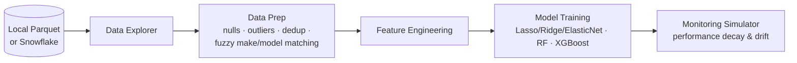

# Intro to Predictive Analytics (Streamlit)

[](https://github.com/lzhao-byte/used_car_price_predictions/actions/workflows/ci.yml)

An interactive, multi-page Streamlit app that walks non-specialists through the full predictive-analytics lifecycle on a used-car price dataset. I built it as a hands-on lab for company-wide data-literacy training ("Data Days").

**Live demo:** https://intro-to-predictive-analytics.streamlit.app

## What you can do

| Page | What it covers |
|---|---|
| **Data Explorer** | Profile the raw data and look at distributions and relationships with interactive Plotly charts |
| **Data Prep** | Inspect the schema, handle nulls, trim outliers (IQR or percentile), remove duplicates, and standardize messy make/model names against a reference list using fuzzy matching (RapidFuzz) with a confidence score |
| **Feature Engineering** | Add, transform, and select features |
| **Model Training** | Train and compare linear models (Lasso / Ridge / ElasticNet), Random Forest, and XGBoost; view metrics (MAE, RMSE, R²) and predictions |
| **Monitoring (Simulation)** | Simulate production data over time to show how model performance degrades under data drift, and how you would monitor it |

## How it fits together



Each page reads and writes shared Streamlit session state, so choices made on one page (such as cleaning rules or selected features) carry through to the rest of the pipeline. The Reset button clears everything.

## Tech

Python · Streamlit · Polars · scikit-learn · XGBoost · Plotly · RapidFuzz · Snowflake Snowpark (optional backend)

Data loads from local Parquet files (partitioned by price bin) by default. `utils/snowflake_functions.py` can read the same tables from Snowflake instead. Credentials come only from environment variables (`SNOWFLAKE_USER`, `SNOWFLAKE_ACCOUNT`, `SNOWFLAKE_AUTHENTICATOR`).

## Run locally

```bash
pip install -r requirements.txt
streamlit run home.py
```

You can also open the repo in a GitHub Codespace, which uses the included `.devcontainer`. The app starts automatically.

## Tests

```bash
pip install -r requirements-dev.txt
ruff check .
pytest --cov=utils
```

60 tests cover the logic in `utils/` (68% line coverage): outlier trimming, null handling, de-duplication, fuzzy make/model standardization, feature engineering, the train/test split (the last 1,000 rows are held out for the drift simulator and must not leak into training), model training and metrics, and the local data loader. They run on small synthetic data, so they need no network, no Snowflake account, and no large Parquet files. The Streamlit pages in `pages/` are not unit-tested; CI runs on Python 3.11 and 3.12 (see `.github/workflows/ci.yml`).
